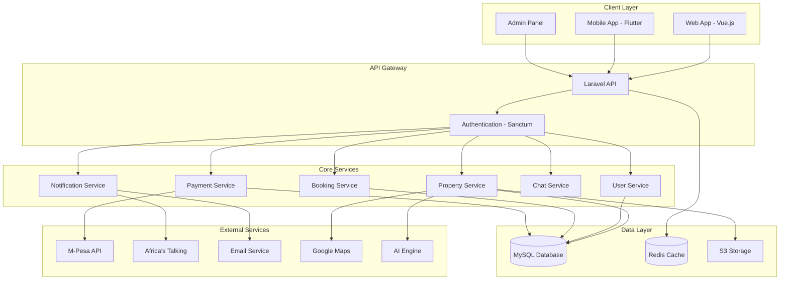

# Murang'a County Rental Marketplace - Project Plan

## Executive Summary

A hyper-local rental marketplace platform targeting Murang'a University (MUT) students and local professionals in Murang'a County. The platform connects landlords with tenants through verified listings, integrated payments, and comprehensive property management tools.

## Technology Stack

### Backend
- **Framework**: Laravel 10.x (PHP 8.2+)
- **Database**: MySQL 8.0
- **Cache**: Redis
- **Queue**: Laravel Queue with Redis driver
- **Search**: Laravel Scout with Meilisearch
- **Storage**: AWS S3 or DigitalOcean Spaces

### Frontend
- **Framework**: Vue.js 3 with Composition API
- **State Management**: Pinia
- **UI Framework**: Tailwind CSS + Headless UI
- **Build Tool**: Vite
- **Mobile**: Flutter (iOS & Android)

### Third-Party Services
- **Payment**: M-Pesa Daraja API
- **SMS**: Africa's Talking API
- **Email**: SendGrid or AWS SES
- **Maps**: Google Maps API
- **AI/ML**: OpenAI API for recommendations
- **Document Signing**: DocuSign or local alternative
- **Real-time**: Laravel Reverb or Pusher

### Infrastructure
- **Hosting**: AWS EC2 or DigitalOcean Droplets
- **CDN**: CloudFlare
- **CI/CD**: GitHub Actions
- **Monitoring**: Laravel Telescope + Sentry
- **Analytics**: Google Analytics + Mixpanel

## System Architecture

## Database Schema Overview

### Core Tables

#### users
- id, name, email, phone, password
- role (landlord, tenant, admin)
- verification_status, id_number
- profile_photo, created_at, updated_at

#### properties
- id, landlord_id, title, description
- property_type, bedrooms, bathrooms
- rent_amount, deposit_amount
- location (address, latitude, longitude)
- amenities (JSON), rules (JSON)
- verification_status, availability_status
- created_at, updated_at

#### property_images
- id, property_id, image_url
- is_primary, order, created_at

#### bookings
- id, property_id, tenant_id
- start_date, end_date, status
- total_amount, deposit_paid
- contract_url, created_at, updated_at

#### payments
- id, booking_id, user_id
- amount, payment_method, transaction_id
- mpesa_receipt, status
- payment_type (rent, deposit, maintenance)
- created_at, updated_at

#### reviews
- id, property_id, tenant_id
- rating, comment, landlord_response
- created_at, updated_at

#### maintenance_requests
- id, property_id, tenant_id
- title, description, priority
- status, assigned_to, resolution_notes
- images (JSON), created_at, updated_at

#### messages
- id, sender_id, receiver_id
- property_id, message, read_at
- created_at, updated_at

#### notifications
- id, user_id, type, title, message
- data (JSON), read_at, created_at

## Key Features Breakdown

### 1. User Management
- Multi-role authentication (Landlord, Tenant, Admin)
- Profile management with verification
- ID verification with document upload
- Two-factor authentication (2FA)
- Password reset and email verification

### 2. Property Listings
- Comprehensive property details form
- Multiple image upload with drag-and-drop
- 360-degree virtual tour support
- Location mapping with Google Maps
- Amenities checklist
- Property rules and requirements
- Availability calendar

### 3. Search & Discovery
- Advanced filters (price, location, bedrooms, amenities)
- Proximity-based search (near MUT campus)
- Map view with property markers
- Saved searches with email alerts
- AI-powered recommendations based on:
  - User preferences
  - Budget constraints
  - Location history
  - Similar user behavior

### 4. Booking System
- Real-time availability checking
- Booking request workflow
- Automated contract generation
- Digital signature integration
- Booking confirmation notifications
- Calendar synchronization

### 5. Payment Integration
- M-Pesa STK Push for instant payments
- Payment tracking and history
- Automated rent reminders
- Deposit management
- Payment reconciliation dashboard
- Receipt generation and email delivery

### 6. Communication
- Real-time chat between landlords and tenants
- Property inquiry system
- Automated notifications (SMS + Email + In-app)
- Broadcast messaging for landlords
- Chat history and file sharing

### 7. Verification System
- Landlord verification (ID, property ownership)
- Property verification (site visits, documentation)
- Tenant verification (ID, references)
- Verification badges and trust scores
- Admin approval workflow

### 8. Reviews & Ratings
- Property reviews by tenants
- Landlord ratings
- Response system for landlords
- Review moderation
- Average rating calculations

### 9. Maintenance Management
- Maintenance request submission
- Priority levels (urgent, high, medium, low)
- Status tracking (pending, in-progress, resolved)
- Image attachments
- Landlord assignment and notifications
- Resolution timeline tracking

### 10. Analytics Dashboard
- Property performance metrics
- Booking statistics
- Revenue tracking
- User engagement analytics
- Popular search terms
- Conversion rates

### 11. Mobile Application
- Native iOS and Android apps (Flutter)
- Push notifications
- Offline mode for saved properties
- Camera integration for property photos
- Location services
- Biometric authentication

### 12. Admin Panel
- User management and moderation
- Property approval workflow
- Payment reconciliation
- Dispute resolution system
- Platform analytics
- Content management
- System configuration

## Implementation Phases

### Phase 1: Foundation (Weeks 1-3)
- Project setup and repository initialization
- Database design and migrations
- Authentication system
- Basic user management
- Admin panel foundation

### Phase 2: Core Features (Weeks 4-7)
- Property listing CRUD
- Image upload and management
- Search and filter functionality
- Property detail pages
- Landlord dashboard

### Phase 3: Booking & Payments (Weeks 8-10)
- Booking system implementation
- M-Pesa integration
- Payment tracking
- Contract generation
- Email notifications

### Phase 4: Communication (Weeks 11-12)
- Real-time chat system
- SMS integration (Africa's Talking)
- Notification center
- Email templates

### Phase 5: Advanced Features (Weeks 13-16)
- AI recommendation engine
- Virtual tours
- Verification system
- Review and rating system
- Maintenance requests

### Phase 6: Mobile App (Weeks 17-20)
- Flutter app development
- API optimization for mobile
- Push notifications
- App store deployment

### Phase 7: Testing & Optimization (Weeks 21-23)
- Comprehensive testing
- Performance optimization
- Security audit
- Bug fixes
- Load testing

### Phase 8: Launch (Week 24)
- Beta testing with MUT students
- Feedback collection
- Final adjustments
- Production deployment
- Marketing launch

## Security Considerations

### Authentication & Authorization
- JWT tokens with Laravel Sanctum
- Role-based access control (RBAC)
- Two-factor authentication
- Session management
- API rate limiting

### Data Protection
- Encryption at rest and in transit
- HTTPS enforcement
- Secure password hashing (bcrypt)
- Input validation and sanitization
- SQL injection prevention
- XSS protection

### Payment Security
- PCI DSS compliance considerations
- Secure M-Pesa integration
- Transaction logging
- Fraud detection mechanisms
- Secure webhook handling

### Privacy Compliance
- GDPR compliance (where applicable)
- Kenya Data Protection Act compliance
- User consent management
- Data retention policies
- Right to deletion

## Performance Optimization

### Caching Strategy
- Redis for session storage
- Query result caching
- API response caching
- Static asset caching via CDN
- Browser caching headers

### Database Optimization
- Proper indexing strategy
- Query optimization
- Database connection pooling
- Read replicas for scaling
- Regular maintenance and cleanup

### Frontend Optimization
- Code splitting and lazy loading
- Image optimization and lazy loading
- Minification and compression
- Service workers for PWA
- CDN for static assets

## Monitoring & Maintenance

### Application Monitoring
- Laravel Telescope for debugging
- Sentry for error tracking
- Performance monitoring
- Uptime monitoring
- API endpoint monitoring

### Analytics
- User behavior tracking
- Conversion funnel analysis
- A/B testing framework
- Custom event tracking
- Revenue analytics

### Backup Strategy
- Daily automated database backups
- File storage backups
- Backup retention policy (30 days)
- Disaster recovery plan
- Regular backup testing

## Deployment Strategy

### Environments
- **Development**: Local development environment
- **Staging**: Pre-production testing environment
- **Production**: Live production environment

### CI/CD Pipeline
1. Code push to GitHub
2. Automated tests run
3. Build process
4. Deploy to staging
5. Manual approval
6. Deploy to production
7. Health checks
8. Rollback capability

### Infrastructure Setup
- Load balancer for high availability
- Auto-scaling groups
- Database replication
- CDN configuration
- SSL certificate management

## Cost Estimation

### Monthly Operating Costs (Estimated)

#### Infrastructure
- Cloud hosting (DigitalOcean/AWS): $50-150
- Database: $20-50
- Redis cache: $15-30
- CDN: $10-30
- Storage (S3): $10-25

#### Third-Party Services
- M-Pesa integration: Transaction fees (variable)
- Africa's Talking SMS: ~$0.01 per SMS
- Email service: $10-30
- Google Maps API: $50-200
- AI API (OpenAI): $20-100

#### Tools & Services
- Domain and SSL: $15/year
- Monitoring (Sentry): $26-80
- Analytics: Free (Google Analytics)
- CI/CD: Free (GitHub Actions)

**Total Estimated Monthly Cost**: $200-700 (depending on usage)

## Success Metrics

### Key Performance Indicators (KPIs)

#### User Metrics
- Monthly Active Users (MAU)
- User registration rate
- User retention rate
- Average session duration

#### Business Metrics
- Number of active listings
- Booking conversion rate
- Average booking value
- Revenue per user
- Payment success rate

#### Engagement Metrics
- Search-to-booking ratio
- Chat engagement rate
- Review submission rate
- Mobile app downloads
- Push notification open rate

#### Technical Metrics
- API response time (<200ms)
- Page load time (<2s)
- Uptime (99.9% target)
- Error rate (<0.1%)

## Risk Management

### Technical Risks
- **Risk**: Third-party API failures (M-Pesa, SMS)
- **Mitigation**: Implement retry mechanisms, fallback options, and monitoring

- **Risk**: Database performance issues at scale
- **Mitigation**: Proper indexing, caching, read replicas

- **Risk**: Security breaches
- **Mitigation**: Regular security audits, penetration testing, bug bounty program

### Business Risks
- **Risk**: Low user adoption
- **Mitigation**: Beta testing with MUT students, referral program, marketing campaigns

- **Risk**: Payment fraud
- **Mitigation**: Verification system, transaction monitoring, dispute resolution

- **Risk**: Competition from established platforms
- **Mitigation**: Focus on hyper-local features, MUT student-specific benefits

## Future Enhancements

### Phase 2 Features (Post-Launch)
- Roommate matching system
- Furniture rental marketplace
- Utility bill splitting
- Community forum
- Event calendar for MUT students
- Student discount partnerships
- Landlord insurance integration
- Property management services
- Automated rent collection
- Credit scoring for tenants

### Scalability Plans
- Expand to other universities in Kenya
- Multi-county support
- White-label solution for other regions
- API marketplace for third-party integrations
- Blockchain for contract management

## Documentation Requirements

### Technical Documentation
- API documentation (Swagger/OpenAPI)
- Database schema documentation
- Deployment guides
- Architecture decision records (ADRs)
- Code style guide

### User Documentation
- User guides for landlords
- User guides for tenants
- FAQ section
- Video tutorials
- Troubleshooting guides

### Business Documentation
- Terms of service
- Privacy policy
- Refund policy
- Service level agreements (SLAs)
- Compliance documentation

## Team Structure (Recommended)

### Development Team
- 1 Backend Developer (Laravel)
- 1 Frontend Developer (Vue.js)
- 1 Mobile Developer (Flutter)
- 1 DevOps Engineer
- 1 UI/UX Designer
- 1 QA Engineer

### Business Team
- 1 Product Manager
- 1 Marketing Manager
- 1 Customer Support Lead
- 1 Business Development Manager

## Conclusion

This comprehensive plan outlines the development of a full-featured rental marketplace platform specifically designed for Murang'a County. The phased approach ensures systematic development while maintaining flexibility for adjustments based on user feedback and market demands.

The platform's focus on verification, local payment integration (M-Pesa), and student-specific features positions it uniquely in the market. Success will depend on strong execution, user adoption among MUT students, and continuous iteration based on user feedback.

**Next Steps**: Review this plan, make any necessary adjustments, and proceed to implementation phase using the Code mode.